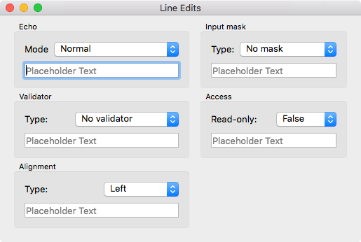
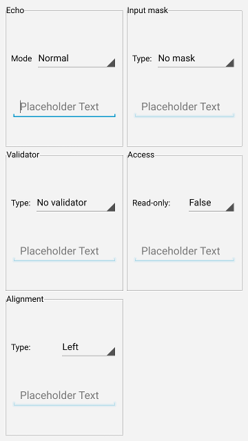

# Screenshots

## Windows


## Mac OS X


## Linux


## Android

### Portrait


### Landscape


[source](https://github.com/therecipe/qt/blob/master/internal/examples/widgets/line_edits/line_edits.go)

---

# Getting Started

## Desktop (Windows / Mac OS X / Linux)

1. Install Go >= 1.5.2 and setup a proper [GOPATH](https://golang.org/doc/code.html#GOPATH)
	* https://storage.googleapis.com/golang/go1.5.3.windows-amd64.msi
	* https://storage.googleapis.com/golang/go1.5.3.darwin-amd64.pkg
	* https://storage.googleapis.com/golang/go1.5.3.linux-386.tar.gz
	* https://storage.googleapis.com/golang/go1.5.3.linux-amd64.tar.gz

2. Install Qt 5.5.1 in `C:\Qt\Qt5.5.1\` or `/usr/local/Qt5.5.1/`
	* https://download.qt.io/official_releases/qt/5.5/5.5.1/qt-opensource-windows-x86-android-5.5.1.exe
	* https://download.qt.io/official_releases/qt/5.5/5.5.1/qt-opensource-mac-x64-android-5.5.1.dmg
	* https://download.qt.io/official_releases/qt/5.5/5.5.1/qt-opensource-linux-x86-android-5.5.1.run
	* https://download.qt.io/official_releases/qt/5.5/5.5.1/qt-opensource-linux-x64-android-5.5.1.run

3. Setup the environment
	* Windows
		* Add the directory that contains **gcc.exe** to your **PATH**

			`C:\Qt\Qt5.5.1\Tools\mingw492_32\bin`

	* Mac OS X
		* Install Xcode >= 7.2

	* Linux
		* Install g++

			`sudo apt-get install g++`

		* Install OpenGL dependencies

			`sudo apt-get install mesa-common-dev`

4. Download the binding

 	`go get github.com/therecipe/qt`

5. Generate, install and test

  	`github.com/therecipe/qt/setup.bat` **(run as admin)**

  	or

  	`github.com/therecipe/qt/setup.sh`

---

## Mobile (Android)

1. Make sure the binding is working by setting up the desktop version

2. Install the Android SDK in `C:\android\android-sdk\` or `/opt/android-sdk/`
	* https://dl.google.com/android/installer_r24.4.1-windows.exe
	* https://dl.google.com/android/android-sdk_r24.4.1-macosx.zip
	* https://dl.google.com/android/android-sdk_r24.4.1-linux.tgz

3. Install the SDK dependencies with `C:\android\android-sdk\tools\android.bat` or `/opt/android-sdk/tools/android`
	* Tools
		* Android SDK Build-tools (23.0.2)
	* Android 5.1.1 (API 22)
		* SDK Platform
	* Extras (Windows only)
		* Google USB Driver

4. Install the Android NDK in `C:\android\android-ndk\` or `/opt/android-ndk/`
	* https://dl.google.com/android/ndk/android-ndk-r10e-windows-x86.exe
	* https://dl.google.com/android/ndk/android-ndk-r10e-darwin-x86_64.bin
	* https://dl.google.com/android/ndk/android-ndk-r10e-linux-x86.bin
	* https://dl.google.com/android/ndk/android-ndk-r10e-linux-x86_64.bin

5. Install Apache-Ant in `C:\android\apache-ant\` or `/opt/apache-ant/`
	* https://mirror.synyx.de/apache/ant/binaries/apache-ant-1.9.6-bin.zip
	* https://mirror.synyx.de/apache/ant/binaries/apache-ant-1.9.6-bin.tar.bz2
	* https://mirror.synyx.de/apache/ant/binaries/apache-ant-1.9.6-bin.tar.gz

6. Install Java SE Development Kit (Linux: install in `/opt/jdk/`)
	* https://www.oracle.com/technetwork/java/javase/downloads/jdk8-downloads-2133151.html

7. Install and test

  	`github.com/therecipe/qt/setup.bat android` **(run as admin)**

    or

  	`github.com/therecipe/qt/setup.sh android`

---

# Quick Start

1. Create a folder `[GOPATH]/src/qtExample`

2. Create a file `[GOPATH]/src/qtExample/main.go`
	```go
package main

import (
		"os"

		"github.com/therecipe/qt/widgets"
)

func main() {
		widgets.NewQApplication(len(os.Args), os.Args)

		var btn = widgets.NewQPushButton2("Hello World", nil)
		btn.Resize2(180, 44)
		btn.ConnectClicked(func(flag bool) {
			widgets.QMessageBox_Information(nil, "OK", "You Clicked me!", widgets.QMessageBox__Ok, widgets.QMessageBox__Ok)
		})

		var window = widgets.NewQMainWindow(nil, 0)
		window.SetWindowTitle("Hello World Example")
		window.Layout().AddWidget(btn)
		window.Show()

		widgets.QApplication_Exec()
}
```

3. Open the command line in `[GOPATH]/src` and run
`qtdeploy build desktop qtExample`

4. You will find the executable file here
`[GOPATH]/src/qtExample/deploy/[GOOS]/qtExample(.exe)`

5. Take a look at the [other examples](https://github.com/therecipe/qt/tree/master/internal/examples)

6. Make yourself familiar with the [qt documentation](https://doc.qt.io/qt-5/classes.html)
