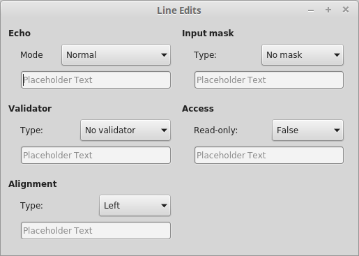
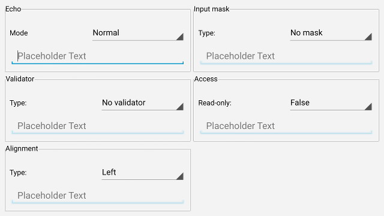
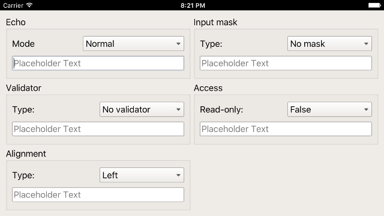

# Screenshots

## Windows


## Mac OS X


## Linux


## Android

### Portrait


### Landscape


## iOS

### Portrait


### Landscape


## Sailfish OS


[source](https://github.com/therecipe/qt/blob/master/internal/examples/widgets/line_edits/line_edits.go)

---

# Getting Started

## Windows / Mac OS X / Linux

1. Install Go >= 1.6.2 and setup a proper [**GOPATH**](https://golang.org/doc/code.html#GOPATH)
	* https://storage.googleapis.com/golang/go1.6.2.windows-amd64.msi
	* https://storage.googleapis.com/golang/go1.6.2.darwin-amd64.pkg
	* https://storage.googleapis.com/golang/go1.6.2.linux-amd64.tar.gz

2. Install Qt 5.7.0 in `C:\Qt\Qt5.7.0\` or `/usr/local/Qt5.7.0/`
	* https://download.qt.io/official_releases/qt/5.7/5.7.0/qt-opensource-windows-x86-android-5.7.0.exe
	* https://download.qt.io/official_releases/qt/5.7/5.7.0/qt-opensource-mac-x64-android-5.7.0.dmg [(**with iOS**)](https://download.qt.io/official_releases/qt/5.7/5.7.0/qt-opensource-mac-x64-android-ios-5.7.0.dmg)
	* https://download.qt.io/official_releases/qt/5.7/5.7.0/qt-opensource-linux-x64-android-5.7.0.run

3. Setup the environment
	* Windows
		* Add the directory that contains **g++.exe** to your **PATH**

			`C:\Qt\Qt5.7.0\Tools\mingw530_32\bin`

	* Mac OS X
		* Install Xcode >= 7.3.1

	* Linux
		* Install g++

			`sudo apt-get install g++`

		* Install OpenGL dependencies

			`sudo apt-get install mesa-common-dev`

4. Download the binding

 	`go get github.com/therecipe/qt`

5. Generate, install and test

	`cd %GOPATH%\src\github.com\therecipe\qt && setup.bat` **(run as admin)**

	or

	`cd $GOPATH/src/github.com/therecipe/qt && ./setup.sh`

---

## Android

1. Set up the desktop version

2. Install the Android SDK in `C:\android\android-sdk\` or `/opt/android-sdk/`
	* https://dl.google.com/android/android-sdk_r24.4.1-windows.zip
	* https://dl.google.com/android/android-sdk_r24.4.1-macosx.zip
	* https://dl.google.com/android/android-sdk_r24.4.1-linux.tgz

3. Install the SDK dependencies with `C:\android\android-sdk\tools\android.bat` or `/opt/android-sdk/tools/android`
	* Tools
		* Android SDK Build-tools (24.0.0)
	* Android 6.0 (API 23)
		* SDK Platform
	* Extras (Windows only)
		* Google USB Driver

4. Install the Android NDK in `C:\android\android-ndk\` or `/opt/android-ndk/`
	* https://dl.google.com/android/repository/android-ndk-r12-windows-x86_64.zip
	* https://dl.google.com/android/repository/android-ndk-r12-darwin-x86_64.zip
	* https://dl.google.com/android/repository/android-ndk-r12-linux-x86_64.zip

5. Install Java SE Development Kit (Linux: install in `/opt/jdk/`)
	* https://www.oracle.com/technetwork/java/javase/downloads/jdk8-downloads-2133151.html

6. Install and test

	`cd %GOPATH%\src\github.com\therecipe\qt && setup.bat android` **(run as admin)**

	or

	`cd $GOPATH/src/github.com/therecipe/qt && ./setup.sh android`

---

## iOS

1. Set up the desktop version on Mac OS X

2. Install and test

	`cd $GOPATH/src/github.com/therecipe/qt && ./setup.sh ios && ./setup.sh ios-simulator`

---

## Sailfish OS

1. Set up the desktop version

2. Install VirtualBox
	* http://download.virtualbox.org/virtualbox/5.0.22/VirtualBox-5.0.22-108108-Win.exe
	* http://download.virtualbox.org/virtualbox/5.0.22/VirtualBox-5.0.22-108108-OSX.dmg
	* http://download.virtualbox.org/virtualbox/5.0.22/VirtualBox-5.0.22-108108-Linux_amd64.run

3. Install the Sailfish OS SDK in `C:\SailfishOS\` or `/opt/SailfishOS/`
	* http://releases.sailfishos.org/sdk/installers/1602/SailfishOSSDK-Beta-1602-Qt5-windows-offline.exe
	* http://releases.sailfishos.org/sdk/installers/1602/SailfishOSSDK-Beta-1602-Qt5-mac-offline.dmg
	* http://releases.sailfishos.org/sdk/installers/1602/SailfishOSSDK-Beta-1602-Qt5-linux-64-offline.run

4. Install and test

	`cd %GOPATH%\src\github.com\therecipe\qt && setup.bat sailfish && setup.bat sailfish-emulator` **(run as admin)**

	or

	`cd $GOPATH/src/github.com/therecipe/qt && ./setup.sh sailfish && ./setup.sh sailfish-emulator`

---

# Quick Start

1. Create a folder `[GOPATH]/src/qtExample`

2. Create a file `[GOPATH]/src/qtExample/main.go`
	```go
package main

import (
		"os"

		"github.com/therecipe/qt/widgets"
)

func main() {
		widgets.NewQApplication(len(os.Args), os.Args)

		var btn = widgets.NewQPushButton2("Hello World", nil)
		btn.Resize2(180, 44)
		btn.ConnectClicked(func(flag bool) {
			widgets.QMessageBox_Information(nil, "OK", "You Clicked me!", widgets.QMessageBox__Ok, widgets.QMessageBox__Ok)
		})

		var window = widgets.NewQMainWindow(nil, 0)
		window.SetWindowTitle("Hello World Example")
		window.Layout().AddWidget(btn)
		window.Show()

		widgets.QApplication_Exec()
}
```

3. Open the command line in `[GOPATH]/src` and run
`qtdeploy build desktop qtExample`

4. You will find the binary file here
`[GOPATH]/src/qtExample/deploy/[GOOS]/qtExample`

5. Take a look at the [other examples](https://github.com/therecipe/qt/tree/master/internal/examples)

6. Make yourself familiar with the [qt documentation](https://doc.qt.io/qt-5/classes.html)
